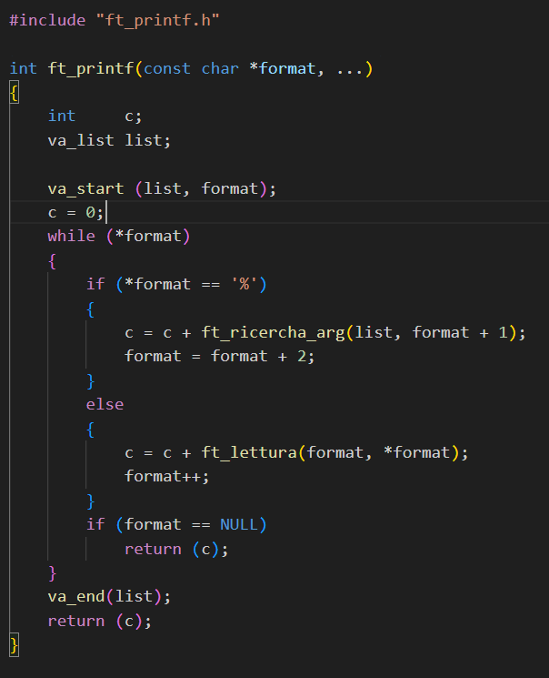
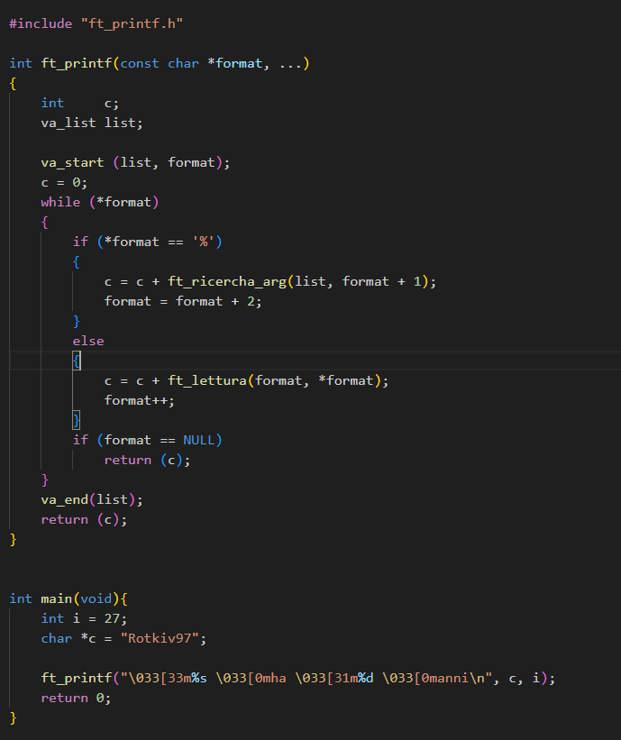
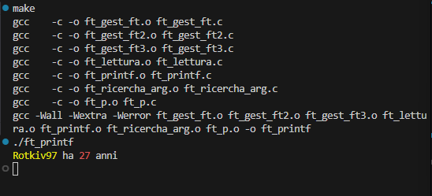

# Ft_prinf

## Introduction project

```
In this project they make us recreate the PRINTF function.

to do this we need to use a C syntax (variadic argument).

This is a feature of the C language that allows you to define functions that can accept a variable number of arguments, as the printf function does.

```



## Create a main under the ft_printf function in the ft_printf.c file.

## EXAMPLE :




# Test project
## Enter the folder where the Makefile is and open the terminal :

